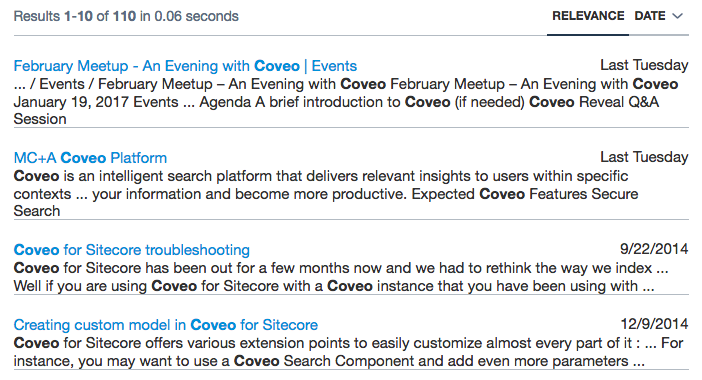
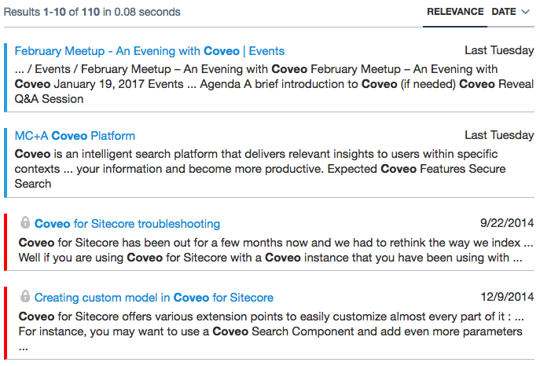

# Creating a Search page

## Before you start

1. Sync the files on your system
1. You will need **NodeJS** for the *"login servers"*.
1. Execute `npm install` from the **JSUI** folder.

## Create your first page

1. Create a new API key for Anonymous Search with this privilege: `Search / Execute queries`.
1. Open up `public/index.html`
1. Edit `public/index.html` and add the search endpoint and the search elements to the page.
  You will need your *API Token* for the endpoint.

Once you have the Search running with an anonymous user, you can add a sign-on.
We provided 2 implementation, one using a fake login server, and one using Google Sign-in.

  * Run `node login.js` to use the fake login server.
  * Run `node google.js` to use the Google Sign-in.

## User Authentication

Now, we will define a more secure search page. We will need a login/token server. We give 2 choices for this tutorial.

### Google Sign-in

If you want to use Google Sign-in, you will need to register an application.
Go to https://developers.google.com/identity/sign-in/web/ for more details and to get your Google Client Id.

Once you get your client id, edit `google.js` and `google_signin.html` to add your client-id.

Then you can start the server with `node google.js`.

### Using the fake login server

We provide a fake login server. It won't really authenticate with a password. You only need to provide the email of the user you which to use. We will assume you are properly authenticated. This is only to keep things simple for this training, this is ***not*** a way to implement authentication.

This fake login server uses cookies to pass along the email and access token back to the client.

You can start the fake server with `node login.js`

## Getting a Search token for one user

1. After you started the server, you can access the login page at `http://localhost:8080`.
1. Create a new *API key* with the `Search / Impersonate` privilege only.
1. In the server code:

  1. Copy your key
  1. Create the request to get the Search token for a user. (look for *TODO* in the javascript file of your login/token server).
    https://developers.coveo.com/display/CloudPlatform/Creating+a+Search+Token

## Customizing your search results

1. Use a HTML template to change results to match this output:

1. Update to use an underscore template and change the style based on the source. For example:

1. [optional] Create a custom component
